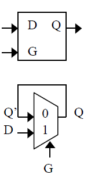
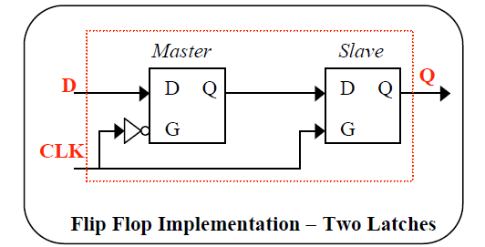
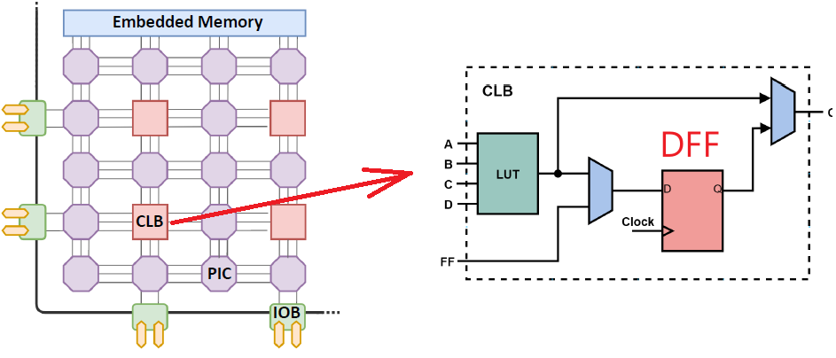
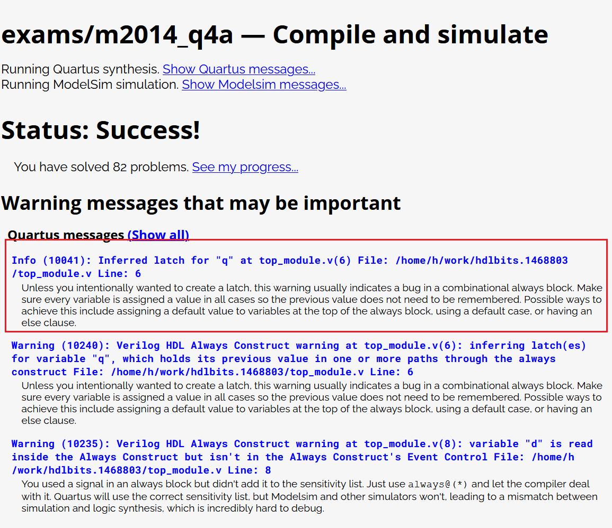

FPGA为什么要避免使用Latch
#############################

:tags: FPGA, Verilog
:category: FPGA
:slug: avoid_latch_in_fpage
:summary: FPGA为什么要避免用latch的原因
:comment_id: avoid_latch_in_fpage
:date: 2021-08-14 13:28
:modified: 2021-08-14 13:28

Latch是啥
=============

如下图的原理示意图，latch有一个输入使能G，数据输入D和数据输出Q。Latch可以看做是一个门，如果latch使能，门打开，
数据输入能通过门到输出端。如果latch禁止使能，那么门关闭，数据输出会保持之前的值。

实现latch可以通过上面的2输入mux来完成。下面是latch的真值表。可以看出一下特点

* 输出实在G为低电平的时候处于latch锁定状态
* latch不是一个时序电路，它的状态改变是由G的电平决定的，

.. csv-table:: Truth Table - Gated D Latch
  :header-rows: 1
  :file: code/latch_truthtable.csv

为啥要避免latch
=================

latch的特性，导致它有非常危险的地方
  
* G电平容易受干扰，稳定性远差于边沿触发。
* G如果是由组合逻辑的输出控制，非常容易收到glitch干扰，因为组合逻辑的传输延迟特性，会导致信号抵达有先有后，导致glitch

https://www.nandland.com/articles/what-is-a-latch-fpga.html

FPGA设计一定需要知道确定的状态，如果状态不确定，就不能保证逻辑的正确的，这也就是为什么推荐用DFF而不是latch的原因。

下图是DFF的实现方法，它可以由2个latch来实现。DFF是通过边沿触发，很好的避免了glitch的产生。EDA工具的timing report可以保证
它的setup/hold time满足需求。

FPGA设计中为什么要避免latch
=============================

FPGA甚至ASIC设计都要重视或者避免latch，这是为啥呢?

1. latch的产生往往是非设计者本来目的，设计人员的编码风格问题导致了latch的产生，很多时候也意味着逻辑设计的错误。
2. FPGA使用latch资源非常不合算。FPGA的tile组成一般是如下图所示的结构，CLB里面自带了LUT和DFF，DFF是CLB原生的资源。
   不管是否使用，它都在那里。如果用Latch，还是要占用一个DFF(DFF可以配置成只用其中一个Latch)。为了保证逻辑的正确性，
   还需要更多的DFF来使G端口输入信号没有glitch，这样做是得不偿失的。

Latch产生的原因
=========================

由于verilog设计人员的代码风格问题，没有把else或者case的default的缺省值写全，或者是reset电路没有把寄存器输出置为0，这些
不良的编码风格，会导致综合器产生出latch。FPGA的EDA软件有可能会报出warning信息，但是在大型工程warning过多的情况下，
往往会被忽略，所以保证良好的代码风格是避免latch的根本方法。

下面是hdlbits这个网站刷verilog题用的，它有用到Quatus和modelsim编译或者仿真。其中Quatus可以报出latch问题。
直接在线使用，免费花费时间去安装EDA软件。
  
  https://hdlbits.01xz.net/wiki/Exams/m2014_q4a
  
  Note that this is a latch, so a Quartus warning about having inferred a latch is expected. 

以下是latch的源码

.. code-block:: verilog
  :linenos: table

  module top_module (
    input d, 
    input ena,
    output q);

    always @(ena) begin
        if(ena)
            q <= d;
    end 
  endmodule

以及它的仿真输出日志，可见其对latch的描述。

总结
======

1. 无论是ASIC还是FPGA设计，都不要使用latch，除非你清楚的知道latch使用的目的
2. 好的代码风格可以避免综合器产生latch。