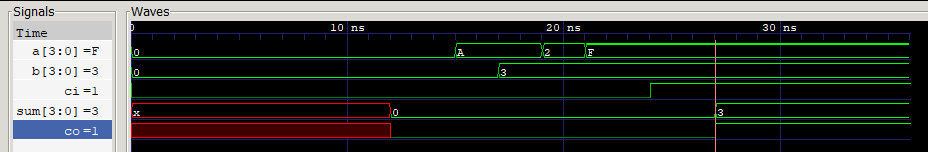
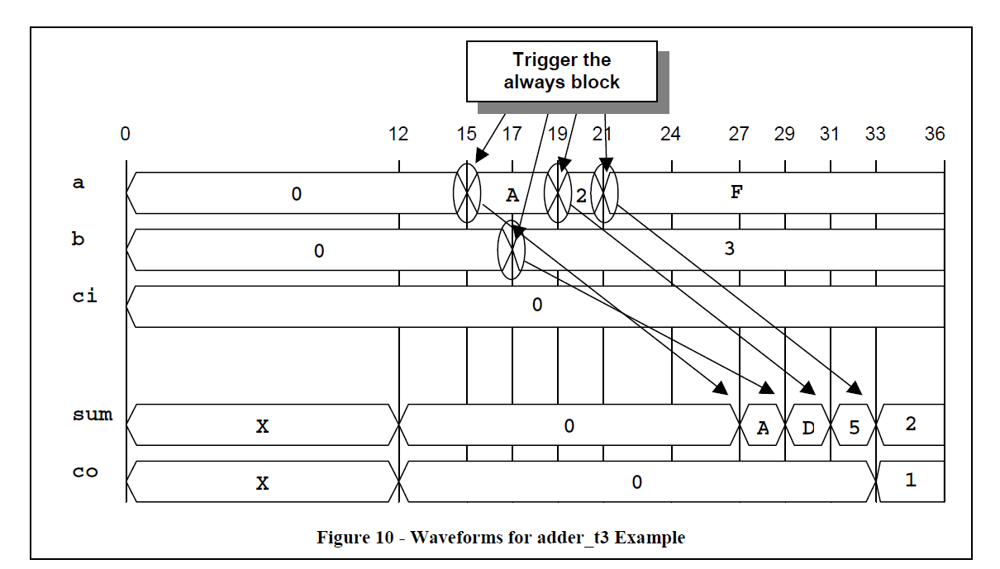
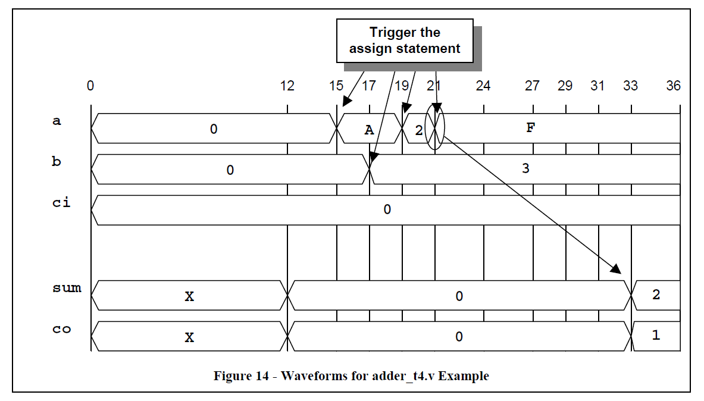

读书笔记 - Clifford E. Cummings关于verilog delay行为模型的论文
###################################################################

:tags: verilog, digital, FPGA
:category: verilog
:slug: verilog_note_about_delay
:summary: 读论文笔记，Clifford E. Cummings关于verilog delay行为模型的论文
:comment_id: verilog_note_about_delay

拜读大神Clifford Cummings的论文 `<<Correct Methods For Adding Delays To Verilog Behavioral Models>> <http://www.sunburst-design.com/papers/CummingsHDLCON1999_BehavioralDelays_Rev1_1.pdf>`_
这篇论文详细的说明了nonblocking和blocking，Continuous assignment，以及LHS，RHS各种组合情况下，那些delay是由缺陷的，那些是正确的。并且针对模型和test bench各做了说明。
看完之后，对delay会了解的比较清楚，有时间的建议读一读原文，就8页内容。

Inertial and transport delay建模
=============================================

verilog是硬件描述语言，用途可以作为模型和test bench。对于模型来说，描述出来的模型无法由硬件实现，那么没有实际意义。
对于test bench则不需要硬件可以实现，它的目的只是为了测试模型。所以此论文也是分情况说明白了这些问题。

Inertial delay
    Inertial delay models only propagate signals to an output after the input signals have remained unchanged (been stable) for a time period equal to or greater than the propagation delay of the model.
    If the time between two input changes is shorter than a procedural assignment delay, a continuous assignment delay, or gate delay, a previously scheduled but unrealized output event is replaced with a newly scheduled output event.

Transport delay
    Transport delay models propagate all signals to an output after any input signals change. Scheduled output value changes are queued for transport delay models.

Reject & Error delay
    Reject & Error delay models propagate all signals that are greater than the error setting, propagate unknown values for signals that fall between the reject & error settings, and do not propagate signals that fall below the reject setting.

Blocking assignment delay models
================================

LHS blocking delays
-------------------

left-hand-side (LHS) or right hand-side (RHS) 如下图所示，是2种不同的方式，对于的行为也不一样。

.. code-block:: verilog

    // Procedural blocking assignment - no delay
    always @(a)   
        y = ~a;

    // Procedural blocking assignment - LHS delay
    always @(a)
        #5 y = ~a;
    
    // Procedural blocking assignment - RHS delay
    always @(a)
        y = #5 ~a;

下面的adder_t1的代码的例子，输出应该在输入改变之后的12ns之后做出更新。
假如输入a在15ns时刻变化，那么如果a,b,ci在接下来的9ns无论任何时候发生变化，输出都只会在9ns结束的时候变化。
那么这个模型只允许ci输入延时3ns到sum和carry输出，而不是12ns。

.. code-include:: code/verilog_note_about_delay/adder_t1.v
    :lexer: verilog
    :encoding: utf-8
    :tab-width: 2

这个是仿真的结果，仿真工具用的是免费的 `Icarus Verilog <http://iverilog.icarus.com/>`_ ,用gtkwave看波形。

    adder_t1仿真波形

.. raw:: html

    
    

同样，给任何时序逻辑LHS延时的组合逻辑都是有缺陷的。

下面的代码中adder_t7a，把延时放在了第1个blocking assign上，第2个assign没有延时，它和adder_t1存在同样的缺陷。

adder_t7b, 第1个blocking assign没有延时, 第2个blocking assign上有延时。这里存在的问题是输入变动，临时的值会保持12ns才能传输到输出，而且12ns任何变化都不能体现到输出，
这就说老的错误的值会保持，直到更多的输入值发生变化。这些adder模型不能给任何已知的硬件建模(不存在这样行为的硬件)。

.. code-include:: code/verilog_note_about_delay/adder_t7.v
    :lexer: verilog
    :encoding: utf-8
    :tab-width: 2

**建模的准则:** 不要把delay放在blocking assignment的LHS来建模组合逻辑，这是一个糟糕的编码方式。

**Test bench准则:** 把delay放在test bench blocking assignment的LHS是合理的，这个是用来做激励的时间顺序间隔的。

RHS blocking delays
-------------------

blocking assignment组合逻辑，把delay放在RHS同样也是有缺陷。

如下面的代码，输出值应该再输入变化之后的12ns更新。如果a在15ns的时候变化，RHS的输入值会被采样到，并保持到12ns之后，
但是12ns之类a,b,ci的变化则不会影响。也就说老的错误的值也会保留直到更多的输入变化。

.. code-include:: code/verilog_note_about_delay/adder_t6.v
    :lexer: verilog
    :encoding: utf-8
    :tab-width: 2

下面的adder_t11a和adder_t11b也有和adder_t6同样的问题。 没有任何已知的硬件和上述RHS描述的模型一样。

.. code-include:: code/verilog_note_about_delay/adder_t11.v
    :lexer: verilog
    :encoding: utf-8
    :tab-width: 2

**建模的准则:** 不要把delay放在blocking assignment的LHS来建模组合逻辑，这是一个糟糕的编码方式。

**Test bench准则:** 把delay放在test bench blocking assignment的RHS非常容易引起误解，尽量避免这种方式。

Nonblocking assignment delay models
====================================

.. code-block:: verilog

    // Procedural nonblocking assignment - no delay
    always @(a)
      y <= ~a;

    // Procedural nonblocking assignment - LHS delay
    always @(a)
      #5 y <= ~a;
  
    // Procedural nonblocking assignment - RHS delay
    always @(a)
      y <= #5 ~a;

LHS nonblocking delays
-----------------------

nonblocking assignments放在LHS也是有缺陷。下面adder_t2的例子存在和adder_t1一样的问题。如果在时间15ns处输入a改变，
在接下来的9ns内如果a,b,ci有变化，输出是根据最后的a,b,ci的值来更新。这样的模型ci的变化传输到输出sum和carry只要3ns。

.. code-include:: code/verilog_note_about_delay/adder_t2.v
    :lexer: verilog
    :encoding: utf-8
    :tab-width: 2

**建模的准则:** 不要把delay放在nonblocking assignment的LHS来建模组合逻辑，这是一个糟糕的编码方式。

**Test bench准则:** nonblocking assignment比blocking assignment仿真效率低；因此，不推荐把delay放在nonblocking assignment的LHS

RHS nonblocking delays
----------------------

nonblocking assignments的RHS delay可以非常精确的描述组合逻辑的传输延时(transport delay)

下面的adder_t3例子，如果a在15处改变值，输出的值会立即计算并且加入队列，在12ns之后赋值到输出。在输出值被加入队列之后，
还没到达赋值时间之前，always模块会准备好下一次的触发。这就意味着所有的输入时间都会被加入到输出的队列，会在12ns之后生效。
这种编码方式描述的是组合逻辑的传输延时。

.. code-include:: code/verilog_note_about_delay/adder_t3.v
    :lexer: verilog
    :encoding: utf-8
    :tab-width: 2

下图是adder_t3对应的时序波形

    adder_t3时序波形

**推荐的应用:** 用这种代码描述延时线的行为逻辑

**建模的准则:** 只把nonblocking assignments的RHS用于传输输出传播行为。这样的编码可以准确的描述出模型的延时线和组合逻辑的纯传输延时，
但是这种方式也会倒是仿真的速度变慢，

**Test bench准则:** 这种方式经常用于test bench在激励信号需要在时钟沿之后经过延时按计划输出的场景，同时也不会阻塞接下来的时序模块。

Multiple RHS nonblocking delays
-------------------------------

只有在一种情况下，多个sequential nonblocking assignments的RHS演示才正确，即 **所有输入信号和临时变量都要加入敏感信号列表** ；
其他情况下都是有缺陷的。如下面的代码，adder_t9c和adder_t9d的例子。非阻塞赋值是并行执行的而由于tmp信号也在敏感信号列表里面，
所以它的变化也可以触发always模块，计算RHS公式并更新LHS的值。

.. code-include:: code/verilog_note_about_delay/adder_t9.v
    :lexer: verilog
    :encoding: utf-8
    :tab-width: 2

**建模的准则:** 通常来说，不要在非阻塞组合逻辑的RHS侧放delay。这种编码方式容易引起误解，而且仿真效率不高。
时序逻辑经常用这种方法来表示clock-to-output行为。

**Test bench准则:** 在有些多时钟设计的验证套件会使用这种多个非阻塞模式RHS延时；但是这种编码方式容易引起误解，
所以通常来说不推荐在testbench用这种方式。

Continuous assignment delay models
==================================

通过continuous assignments增加延时能精确的给组合逻辑建模，是一种推荐的编码方式。

.. code-block:: verilog
    
    assign y = ~a;    // Continuous assignment - no delay
    
    assign #5 y = ~a; // Continuous assignment - LHS delay
    
    assign y = #5 ~a; // Illegal continuous assignment - RHS delay
    
    assign y <= ~a;   // Illegal continuous nonblocking assignment

下面代码adder_t4例子，输出会在最后一个输入变化之后的12ns内不会变。任何间隔不超过12ns的变化会被加入到队列(输出值会和相应的事件对应)，将会产生新的输出事件。
下图的时序对应的是adder_t4，一开始输入a在15ns的时候有变化，这样会在队列增加一个27ns之后的输出变化事件。但是输入b的一个变化以及输入a的2个后来的变化，
分别在时间17，19，21，从而带来4个输出计划。之后最后一个输出计划实际会完成，输出变化在33ns。
Continuous assignments并不会把输出放到队列，只是追踪到下一个输出变化。从而，Continuous assignments在组合逻辑建模了inertial delays。

.. code-include:: code/verilog_note_about_delay/adder_t4.v
    :lexer: verilog
    :encoding: utf-8
    :tab-width: 2

    adder_t4时序波形

Multiple continuous assignments
-------------------------------

类似的可以用continuous assignments增加delay的方法，它的输出通常是来驱动其他的continuous assignments，
如下面的代码所示，它可以精确的对inertial delays建模。

.. code-include:: code/verilog_note_about_delay/adder_t10.v
    :lexer: verilog
    :encoding: utf-8
    :tab-width: 2

Mixed no-delay always blocks and continuous assignments
-------------------------------------------------------

在always模块里面的逻辑没有delay，然后把always模块输出的中间值传递给带有delay的continuous assignment，
如下面的代码所示，它也能精确的对组合逻辑的inertial delays建模。

在adder_t5的例子当中，tmp变量会随着任何输入变量变化而更新。continuous assignment outputs在tmp变化之后的
12ns更新。任何always模块输入变化都会导致tmp变化，这都会在。continuous assignment outputs增加计划。
如果tmp保持12ns不变化，那么continuous assignment也不会变化。这种代码可以给inertial delays建模

.. code-include:: code/verilog_note_about_delay/adder_t5.v
    :lexer: verilog
    :encoding: utf-8
    :tab-width: 2

**建模的准则:** 用continuous assignments带有delay建模，这种方法可以精确的给组合逻辑inertial delays建模

**建模的准则:** 使用always模块不带有delay来建模，可以方便的应用verilog这写行为描述语法如"case-casez-casex", "if-else", 等等。
然后输出到带有delay的continuous assignments， 可以精确的给组合逻辑inertial delays建模

**Test bench准则:** continuous assignments可以在teshbench的任何地方来驱动激励值到输入口和双向口。

结论
======